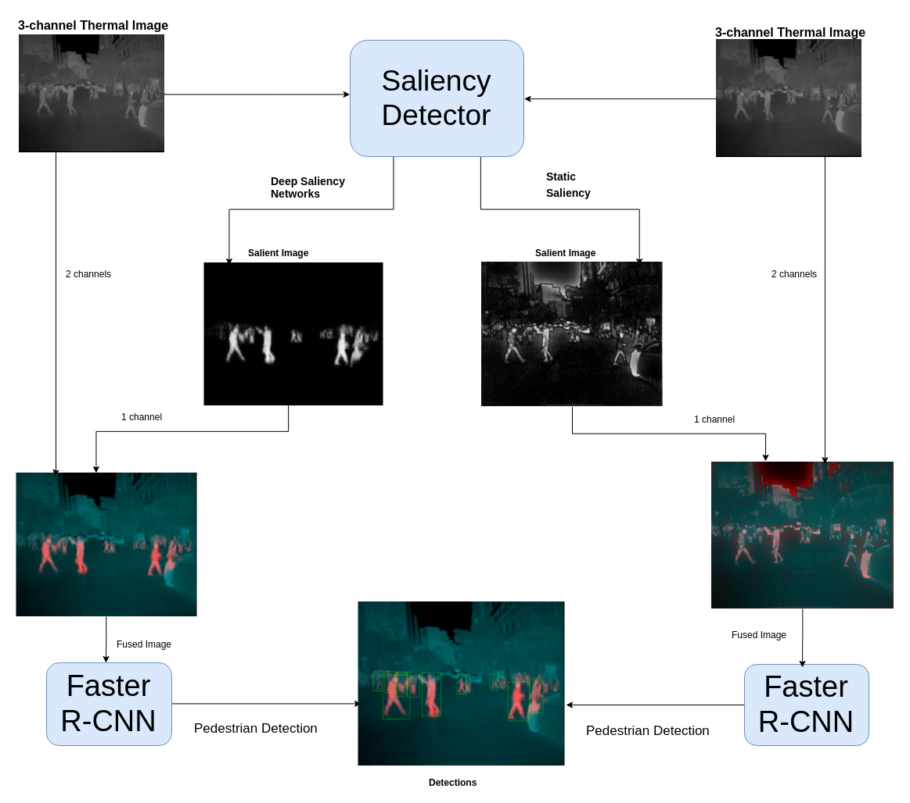

# Pedestrian Detection fom Thermal Images using Saliency Maps

Authors

## Abstract

## KAIST Salient Pedestrian Dataset

### Description

### Sample Images

### Downloads
- [Training Set]()
- [Test Set]()
- [Imagesetfiles]()
- [Code]()

### Pre-trained Weights for State-of-the-Art Deep Saliency Detection Networks for this Dataset
- [PICA-Net]()
- [R3-Net]()
- [Deeply Supervised Salient Object Detection with Short Connections]()

## Pedestrian Detection Using Faster R-CNN

### Code

- [Faster R-CNN]() 
- [PICA-Net]()
- [R3-Net]()
- [Deeply Supervised Salient Object Detection with Short Connections]()

### Pretrained Weights for Faster R-CNN trained on the KAIST Pedestrian Dataset

- [Thermal Images]()
- [Static Saliency Maps generated from Thermal Images]()
- [Thermal Images Fused with Static Saliency Maps]()
- [Thermal Images Fused with Saliency Maps generated using PICA-Net]()
- [Thermal Images Fused with Saliency Maps generated using R3-Net]()
- [Thermal Images Fused with Saliency Maps generated using Deeply Supervised Salient Object Detection with Short Connections]()
