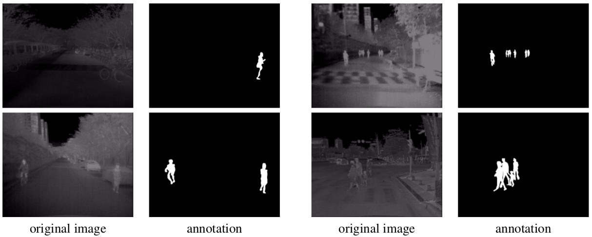
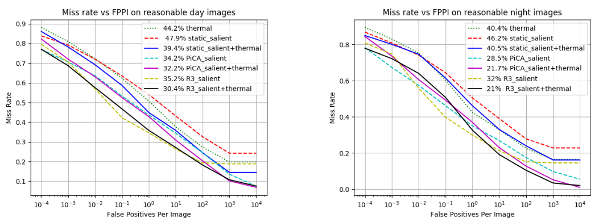
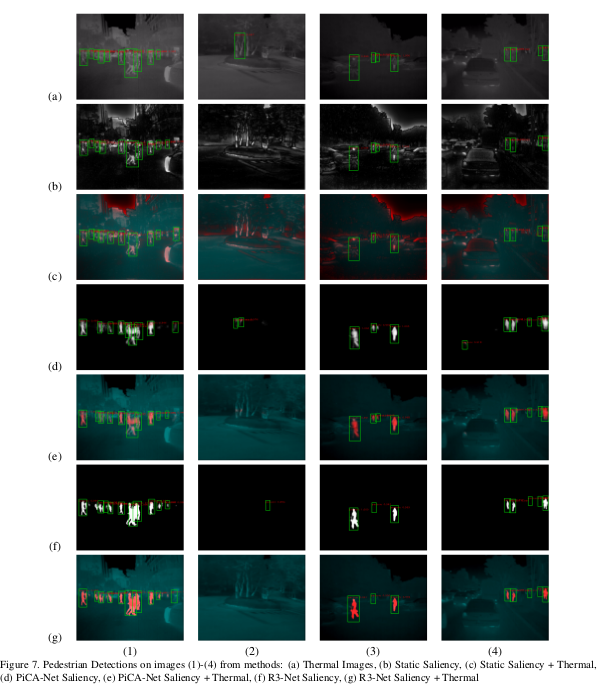

# Pedestrian Detection from Thermal Images using Saliency Maps

<center>Debasmita Ghose*, Shasvat Desai*, Sneha Bhattacharya*, Deep Chakraborty*, Madalina Fiterau, Tauhidur Rahman</center>

<center><italics>University of Massachusetts, Amherst</italics></center>

#### IEEE Workshop on Perception Beyond the Visible Spectrum, CVPR 2019 

[Paper](https://arxiv.org/pdf/1904.06859v1.pdf) | [Website](https://information-fusion-lab-umass.github.io/Salient-Pedestrian-Detection/) 

## Abstract

Thermal images are mainly used to detect the presence of people at night or in bad lighting conditions, but perform
poorly at daytime. To solve this problem, most state-of-the-art techniques use a fusion network that uses features from
paired thermal and color images. We propose to augment thermal images with their saliency maps as an attention
mechanism to provide better cues to the pedestrian detector, especially during daytime. We investigate how such an
approach results in improved performance for pedestrian detection using only thermal images, eliminating the need
for color image pairs. We train a state-of-the art Faster R-CNN for pedestrian detection and explore the added
effect of PiCA-Net and R3-Net as saliency detectors. Our proposed approach results in an absolute improvement
of 13.4 points and 19.4 points in log average miss rate over the baseline in day and night images respectively. We also annotate
and release pixel level masks of pedestrians on a subset of the KAIST Multispectral Pedestrian Detection dataset,
which is a first publicly available dataset for salient pedestrian detection.

<center>

</center>


## Our KAIST Salient Pedestrian Dataset

### Description
We select 1702 images from the training set of the
[KAIST Multispectral Pedestrian dataset](https://sites.google.com/site/pedestrianbenchmark/), by sampling
every 15<sup>th</sup> image from all the images captured during the day and every 10<sup>th</sup>image from all the images captured during the night, which contain pedestrians. These images were selected in order to have approximately the same number of images captured on both times of the day (913 day images and 789 night images), containing 4170 instances of pedestrians. We manually annotate these images using the [VGG Image Annotator tool](http://www.robots.ox.ac.uk/~vgg/software/via/) to generate the ground truth saliency masks based on the location of the bounding boxes on pedestrians in the original dataset. Additionally, we create a set of 362 images with similar annotations from the test set to validate our deep saliency detection networks, with 193 day images and 169 night images, containing 1029
instances of pedestrians. The distribution of pedestrians per frame is shown in the figure below:

<center>

</center>

### Sample Images


<center>

</center>

### Downloads

#### Dataset
- [README](https://drive.google.com/file/d/1jrbD0qhgGzZs4BtUy-Df5YZ3GM_7GW5z/view?usp=sharing)
- [Training Set](https://drive.google.com/drive/folders/12a5OxlFF3ZNcAWARumASsiRHnp0l7bRu?usp=sharing)
- [Test Set](https://drive.google.com/drive/folders/1aC7NPlOV-IM9yDZbQ8FUwNhRMGMG54uI?usp=sharing)
- [Imagesetfiles](https://drive.google.com/drive/folders/1tXrAQIIXjX8ZN2lgOqU8UtLX2gGnKNGP?usp=sharing)

## Pedestrian Detection Using Faster R-CNN

### Code

- [Faster R-CNN](https://github.com/DebasmitaGhose/Multimodal_Influenza_Detection/tree/fppi_LAMR/faster-rcnn.pytorch) 
- [PICA-Net](https://github.com/deepc94/PiCANet-Implementation)
- [R3-Net](https://github.com/snehabhattacharya/R3Net)

### Results
<center>

</center>

### Sample Images

<center>

</center>

### Citation

If you find this work or dataset useful, please consider citing:

```
@inproceedings{ghose2019pedestrian,
  title={Pedestrian Detection in Thermal Images using Saliency Maps},
  author={Ghose, Debasmita and Desai, Shasvat M and Bhattacharya, Sneha and Chakraborty, Deep and Fiterau, Madalina and Rahman, Tauhidur},
  booktitle={Proceedings of the IEEE Conference on Computer Vision and Pattern Recognition Workshops},
  pages={0--0},
  year={2019}
}
```


*Authors Contributed Equally


